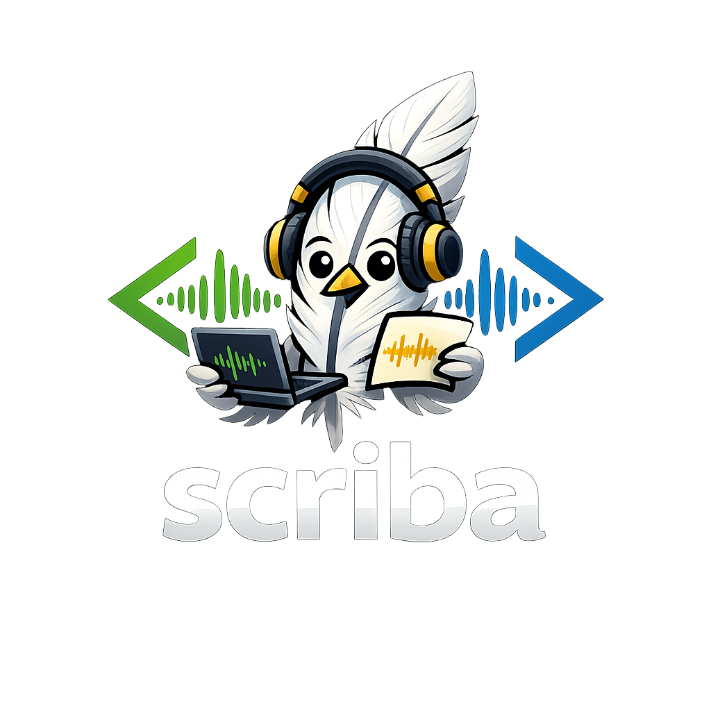
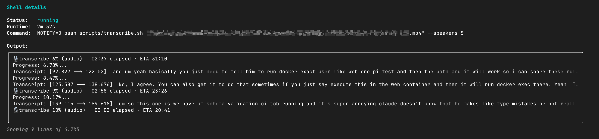

<p align="center">
  
</p>

<h1 align="center">scriba</h1>

<p align="center">
  <b>Free, local, accurate meeting transcription with speaker recognition — for your AI assistant or second brain.</b><br>
  Drop a file path into your AI agent's chat — or run one command in your terminal — and get a clean, speaker-labeled transcript. Works with <a href="https://docs.claude.com/en/docs/claude-code/overview">Claude Code</a>, Codex, Cursor, Aider &amp; others via <a href="./AGENTS.md"><code>AGENTS.md</code></a>, or as a plain CLI with no AI at all. Everything runs on your Mac: no cloud, no uploads, no subscription.
</p>

<p align="center">
  <a href="https://github.com/AlexanderAbramovPav/scriba/actions/workflows/ci.yml"></a>
  <a href="https://github.com/AlexanderAbramovPav/scriba/stargazers"></a>
  <a href="./LICENSE"></a>
  
  
  
  <a href="./AGENTS.md"></a>
</p>

## Contents
- [Why](#why)
- [How this compares](#how-this-compares)
- [What you'll get](#what-youll-get)
- [Install](#install)
- [Usage](#usage)
- [Limitations](#limitations)
- [Advanced — for power users](#advanced--for-power-users)
- [License](#license) · [Acknowledgments](#acknowledgments)

## Why

- **Your audio never leaves your computer.** Nothing is uploaded to any cloud — not Otter, not AssemblyAI, not OpenAI, not us. Transcription and speaker recognition run locally on your Mac (or Linux box).
- **Works with anything.** Zoom recordings, voice memos, podcast files, phone call exports — `.mp4`, `.mov`, `.m4a`, `.mp3`, `.wav`, `.webm`, you name it. The skill handles the format conversion for you.
- **Accurate speaker recognition — and honest about it.** "Who said what" runs on [pyannote](https://github.com/pyannote/pyannote-audio)'s `speaker-diarization-community-1` — one of the most accurate *open-source* diarization models (its authors [report](https://huggingface.co/pyannote/speaker-diarization-community-1) ~10–11% DER on standard benchmarks), picked so it runs on a **normal Mac (M3 / 16 GB)**, not only a top-end M-Max. A heavier model (DiariZen-WavLM) edges it on some English benchmarks but costs a lot more compute; scriba favors the accuracy/footprint balance. Words come from [OpenAI Whisper large-v3](https://github.com/openai/whisper). **Don't take our word for it — [measure it on your own audio](./benchmarks/)** with `scripts/benchmark_der.py`.
- **You can actually see it working.** Live progress in your editor's statusline, in a side terminal, or as a macOS notification when it's done — pick what you like. No more staring at a black screen wondering if it's stuck.
- **Just one command.** No setup steps to learn. The assistant walks you through anything you don't have yet (HuggingFace account, etc.) in plain language.
- **Built to be run automatically.** Point a `launchd`/`cron` watcher at your Zoom or Meet recordings folder — every call becomes a searchable transcript that flows into your **second brain / personal AI knowledge base** (Obsidian, Notion, Cognee, mem0, whatever you use). The more conversations you capture and feed your assistant, the sharper its answers about *you* get. See [Karpathy on personal Wikis](https://x.com/karpathy/status/1655994367033524225) for the broader idea.

## How this compares

|                                       | scriba | Otter / Fireflies / Granola | Local Whisper alone |
| ------------------------------------- | :----------------: | :-------------------------: | :-----------------: |
| Audio stays on your computer          |        ✅          |             ❌              |         ✅          |
| Tells you who said what                                  |        ✅          |             ✅              |         ❌          |
| Tells you who said what — *and how sure it is*           |        ✅          |             ❌              |         ❌          |
| Cost after install                    |      **$0**        |        $10–30/mo            |         $0          |
| Works offline                         |        ✅          |             ❌              |         ✅          |

*"…and how sure it is"*: every word in the JSON sidecar carries an ASR
confidence, a speaker-attribution confidence, and an overlap flag, so your AI
knows which lines to trust and which to treat as shaky. And you can put a number
on the diarization itself — [`benchmarks/`](./benchmarks/) ships a pure-Python
DER scorer you run on your own labeled audio.

## What you'll get

A portable `<title>.transcript/` folder next to your input video, holding the Markdown plus its assets, with **a 10-second voice clip per speaker** embedded right in the file (click ▶ to play in Obsidian / VS Code / GitHub):

```markdown
# q3-planning-sync

## Speakers — identify who's who

**Speaker 1** (80% of speaking time).
<audio controls src="data/speaker-1.wav"></audio>

Sample utterances:
> [00:00:03] «So the launch is moved to Friday — can we ship the docs by Thursday?»
> [00:00:40] «...»

**Speaker 2** (18% of speaking time).
<audio controls src="data/speaker-2.wav"></audio>
...
```

The assistant then asks you "who's Speaker 1?" — you answer, and it renames them everywhere in the transcript.

## Install

```bash
git clone https://github.com/AlexanderAbramovPav/scriba ~/.claude/skills/scriba
```

That's it. **Don't pre-configure anything.** The first time you transcribe, the assistant will pause and walk you through a one-time ~30-second step: creating a free HuggingFace account and pasting a token back into the chat. Three clicks in a browser, no terminal commands. You'll never see it again after that.

> *Why HuggingFace?* It's the open-source equivalent of an app store for AI models. The speaker-recognition model is free, but its authors require accepting a usage agreement once — pretty standard for research-grade open source.

### Don't use Claude Code? Use it with anything else

The core of `scriba` is a bash + Python pipeline. The "skill" layer is a thin wrapper that helps an AI agent guide you through setup and speaker naming — and there's a tool-agnostic version of those instructions in [`AGENTS.md`](./AGENTS.md), supported by most modern AI coding tools.

| Your tool                       | Where to point it                                                            | How to invoke                            |
| ------------------------------- | ---------------------------------------------------------------------------- | ---------------------------------------- |
| **Claude Code**                 | clone into `~/.claude/skills/scriba/` *(default install command above)*       | `/scriba <file>`                         |
| **OpenAI Codex CLI**            | clone anywhere, place `AGENTS.md` at `~/.codex/AGENTS.md` *(or project root)* | "transcribe this meeting: `<file>`"      |
| **Cursor**                      | clone anywhere, copy `AGENTS.md` to `.cursor/rules/scriba.md`                 | mention `@scriba` or natural language     |
| **Continue.dev**                | clone anywhere, register `transcribe.sh` as a custom slash command in `~/.continue/config.yaml` | `/scriba <file>` |
| **Aider**                       | clone anywhere, `aider --read <scriba>/AGENTS.md <file>`                     | natural language in chat                  |
| **Goose** (Block)               | clone anywhere, add as a shell-command extension                             | mention scriba in chat                   |
| **ChatGPT / Claude.ai browser** | open `AGENTS.md`, paste into a "Custom Instructions" or project-context slot | tell the chat the local file path        |
| **No AI at all**                | clone anywhere                                                                | `bash <scriba>/scripts/transcribe.sh <file>` |

`AGENTS.md` is becoming a de-facto standard for cross-tool AI agent instructions — same role as `SKILL.md` but vendor-neutral. The bash CLI works in any environment, with or without an AI driving it.

## Usage

Easiest path is Claude Code (other agents & the plain CLI: see [Use it with anything else](#dont-use-claude-code-use-it-with-anything-else) above). Open Claude Code, type:

```
/scriba /path/to/your-meeting.mp4
```

Now you can walk away. The assistant runs the transcription in the background. While it's working:

- **Live status** is visible inline in your chat statusline (something like `🎙 tx 47% · ETA 01:18`), updated every few seconds.
- **A macOS notification** pops up when it's done (Glass sound).
- Or open a side terminal and run the same command with `--watch` for a full-screen progress view.

<p align="center">
  
</p>
<p align="center"><sub>Live progress streams right into Claude Code's “Shell details” — current stage, % and ETA update as it runs (even while diarization is quiet).</sub></p>

When it finishes, the assistant opens the result and shows you the speakers it found. For each one you get:
- A **short voice clip** (~10 seconds, click play in the chat / your editor — `<audio>` is embedded right in the Markdown).
- **Three sample sentences** with timestamps.

The assistant asks "who is who?" — you answer (e.g. "Speaker 1 is Alice, Speaker 2 is Bob") — it renames them everywhere in the transcript. Done.

## Where files go

Each recording becomes a self-contained, portable folder next to your input file:

```
your-meeting.transcript/      ← move/zip/sync this whole folder; nothing breaks
├── your-meeting.md           ← the transcript (H1 title + frontmatter)
└── data/
    ├── transcript.json       ← rich machine-readable sidecar (per-word confidence, speakers)
    └── speaker-1.wav …       ← one ≤10 s voice clip per speaker, embedded in the MD
```

The MD points at `data/…` with **relative** paths, so the folder travels as a unit — open `your-meeting.md` in any Markdown viewer (Obsidian, VS Code, GitHub) and the embedded `<audio>` players just work.

The **folder/file name is meaningful**: it's derived from your video's name (kebab-cased). When the source name is generic (`zoom_0`, `GMT20260605-120000`, `recording`, …), the assistant picks a real title for you. The original filename is always preserved in the `source:` frontmatter field.

Alongside your recordings, a hidden **`.scriba/`** folder holds corpus-wide state your AI uses to navigate everything: `index.json` (one entry per recording — read once, find any meeting), plus the glossary and persistent voiceprints. Full layout in [`references/file-layout.md`](./references/file-layout.md).

## Beyond one-off meetings — run it automatically

The slash-command flow is the easy path. If you want every conversation captured automatically, point a small watcher at whatever folder your meeting tool dumps recordings into:

```bash
# Watch ~/Documents/Zoom/, transcribe new .m4a or .mp4 files
fswatch -0 ~/Documents/Zoom | while read -d '' f; do
  case "$f" in *.m4a|*.mp4)
    bash ~/.claude/skills/scriba/scripts/transcribe.sh "$f" ;;
  esac
done
```

Then point your second-brain tool (Obsidian, Cognee, mem0, Notion AI, …) at the `*.transcript/*.md` files and you have a personal, private, searchable corpus of everything that's been said in your meetings — feeding back into AI assistants the way [Karpathy described a personal Wiki](https://x.com/karpathy/status/1655994367033524225). The more conversations the assistant can reach, the more it sounds like *you* and the better it answers questions about *your* world.

## Limitations

- Two speakers who sound similar (e.g. brothers, or two soft-spoken voices) may be merged into one.
- Heavy background music or three+ people speaking simultaneously degrades speaker boundaries.
- Apple Silicon strongly recommended. Intel Macs work but are ~3× slower; Linux works (no macOS notification, no MLX fast-mode).
- First run downloads ~3 GB of models — plan accordingly on metered connections.
- Languages other than English and Russian are auto-detected and transcribed, but speaker recognition quality hasn't been benchmarked specifically per language.

---

## Advanced — for power users

Everything below is optional. The slash command flow above is what 99% of people need.

### Run the bash directly

```bash
bash scripts/transcribe.sh <media-file> [--fast] [--speakers N] [--lang XX] [--model M]
```

| Flag | Meaning |
|---|---|
| (default) | Accuracy mode — whisperX large-v3 on CPU + pyannote diarization. Real per-step progress for diarization. |
| `--fast` | MLX (Apple GPU) transcription. Faster but coarser speaker boundaries; no per-step diarize progress on this path. |
| `--speakers N` | Hint the number of speakers (helps pyannote when audio is short or noisy). Default: auto. |
| `--lang XX` | Force ISO language code (`en`, `ru`, `de`, …). Default: auto-detect. |
| `--model M` | Override the whisper model. Default: `large-v3`. |
| `--bootstrap` | Just create the venv, don't transcribe. |
| `--status <file>` | Print a one-line progress summary (cheap to poll). |
| `--watch <file>` | Full-screen TUI watcher (run in a side terminal). |

Speaker renaming after the fact:
```bash
python3 scripts/rename_speakers.py meeting.transcript/meeting.md "Alice,Bob,Carol"
# or explicit mapping:
python3 scripts/rename_speakers.py meeting.transcript/meeting.md --map "Speaker 1=Alice,Speaker 2=Bob"
```

### Monitoring surfaces

Pick the channel that fits your workflow. All read the same source of truth (`*.transcript.progress.json` next to the input — auto-deleted on successful completion together with `*.transcript.log`, so you're left with only the human-facing `<title>.transcript/` folder. Diagnostic files are kept only when something fails).

| Surface | What you do | What you see |
|---|---|---|
| **Statusline integration** | Wire `scripts/statusline.sh` into your Claude Code / tmux / Starship / p10k statusline once. Recipes: [`references/statusline-integration.md`](./references/statusline-integration.md). | `🎙 tx 47%* · ETA 01:18` → `🎙 dia/embedd 50%* · 02:17` → empty. Refreshes every ~3 s in your normal status bar. Zero AI tokens. |
| **`--watch` TUI** | `bash scripts/transcribe.sh --watch /path/to/file.mp4` in a side terminal. | Full-screen progress bar, audio %, ETA, last log line. 2 s refresh. Ctrl-C detaches; transcription keeps running. |
| **`--status` one-liner** | `bash scripts/transcribe.sh --status /path/to/file.mp4` | One line: `stage=transcribe · elapsed 02:30 · ETA 01:18 (observed) · audio 47% (measured) · wall 51% · …` |
| **`*.transcript.progress.json`** | Read the file directly. | Compact JSON (~350 B) with the canonical schema (see [`references/eta-factors.md`](./references/eta-factors.md)). Refreshed every 5 s. |
| **macOS notification** | Nothing — fires automatically on `done` if `osascript` is available. | Notification Center card "scriba · <file> · <wall-clock>" with the Glass sound. |
| **`*.transcript.log`** | `tail -f /path/to/file.transcript.log` | Raw whisperX + pyannote output, including each per-segment `Transcript: [start --> end] text` line and each `diarize/<step> N% (X/Y)` progress event. |

### Performance — how long will it take?

**Rule of thumb: a 1-hour recording takes roughly 1 hour on an M4 Max, ~1.5 h on an M2 Max, ~2 h on an M1.** First run is slower (~5 min one-time model download); after that, the skill auto-calibrates to your machine's actual speed and the next ETA is anchored to *your* measured rate.

The model: `wall_clock ≈ audio_sec × factor + warmup`, where **`factor`** is the wall-clock-per-audio-second ratio for the full pipeline (transcribe + align + diarize). Anchored to one observed M4 Max run = 1.0× (Jun 2026, `batch_size=1`, `int8` compute_type). Other chips scaled from public CPU benchmarks — starting estimates only; the calibration cache at `~/.config/scriba/calibration.json` replaces the value with the actual observed rate after the first ≥60 s run.

| Chip | `factor` | Rough wall-clock for 1 h of audio |
|---|---:|---:|
| M1 | 2.0× | ~2 h |
| M1 Pro | 1.7× | ~1.7 h |
| M1 Max | 1.5× | ~1.5 h |
| M1 Ultra | 1.3× | ~1.3 h |
| M2 | 1.7× | ~1.7 h |
| M2 Pro | 1.5× | ~1.5 h |
| M2 Max | 1.3× | ~1.3 h |
| M2 Ultra | 1.2× | ~1.2 h |
| M3 | 1.5× | ~1.5 h |
| M3 Pro | 1.3× | ~1.3 h |
| M3 Max | 1.2× | ~1.2 h |
| M4 | 1.3× | ~1.3 h |
| M4 Pro | 1.1× | ~1.1 h |
| **M4 Max** | **1.0×** | **~1 h** ← anchor |
| `--fast` (MLX, any Apple Silicon) | ~0.5× | ~30 m |

Intel and unknown CPUs fall back to `2.0×`. Linux works (degraded: no macOS notification, no native MLX) — same factor table applies, the cache corrects after the first run.

**Have a chip not in this table, or a measurably different rate?** See [`CONTRIBUTING.md`](./CONTRIBUTING.md) — adding a row is a one-line PR.

### How it works

1. `transcribe.sh` extracts the input to 16 kHz mono WAV via ffmpeg.
2. `transcribe_whisperx.py` calls whisperX with `verbose=True`, which prints `Transcript: [start --> end] text` per segment as it's decoded.
3. The wrapper bypasses whisperX's `DiarizationPipeline` and calls `pyannote.audio.Pipeline` directly with a custom `TextProgressHook` so each pyannote sub-step (`segmentation`, `embeddings`, `clustering`, `speaker_counting`, `discrete_diarization`) reports its real `completed/total` counters as plain text.
4. A bash ticker scans the log every 5 s and writes the canonical `*.progress.json`.
5. All monitoring surfaces read that one JSON.
6. On exit, `json_to_md.py` turns the JSON into Markdown inside `<title>.transcript/`, ffmpeg cuts one ≤10 s WAV clip per speaker into its `data/` folder for the embedded `<audio>` players, the JSON sidecar is copied there too, and `update_index.py` upserts the recording into `.scriba/index.json`. See [`references/file-layout.md`](./references/file-layout.md).

## License

[MIT](./LICENSE) — © 2026 [Alexander Abramov](https://github.com/AlexanderAbramovPav).
Source & issues: <https://github.com/AlexanderAbramovPav/scriba>

Runtime dependencies (whisperX, pyannote.audio, faster-whisper, CTranslate2, OpenAI Whisper, ffmpeg) are installed locally, not vendored. Their licenses are catalogued in [`THIRD_PARTY_LICENSES.md`](./THIRD_PARTY_LICENSES.md).

**One model has an attribution clause**: the default diarization pipeline `pyannote/speaker-diarization-community-1` is [CC-BY-4.0](https://creativecommons.org/licenses/by/4.0/). If you redistribute output produced with this skill, include a short attribution:

> Speaker diarization powered by [pyannote/speaker-diarization-community-1](https://huggingface.co/pyannote/speaker-diarization-community-1) by Hervé Bredin / pyannoteAI, licensed under CC-BY-4.0.

## Acknowledgments

This skill is glue around four excellent OSS projects:

- [**whisperX**](https://github.com/m-bain/whisperX) — Max Bain et al. — word-level alignment + diarization orchestration on top of faster-whisper.
- [**pyannote.audio**](https://github.com/pyannote/pyannote-audio) — Hervé Bredin et al. — neural speaker diarization.
- [**faster-whisper**](https://github.com/SYSTRAN/faster-whisper) — SYSTRAN — the actual ASR engine, CTranslate2-backed.
- [**OpenAI Whisper**](https://github.com/openai/whisper) — OpenAI — the acoustic model.

And on [`uv`](https://github.com/astral-sh/uv) (Astral) for the bootstrap, and [`ffmpeg`](https://ffmpeg.org/) for everything audio-shaped.
